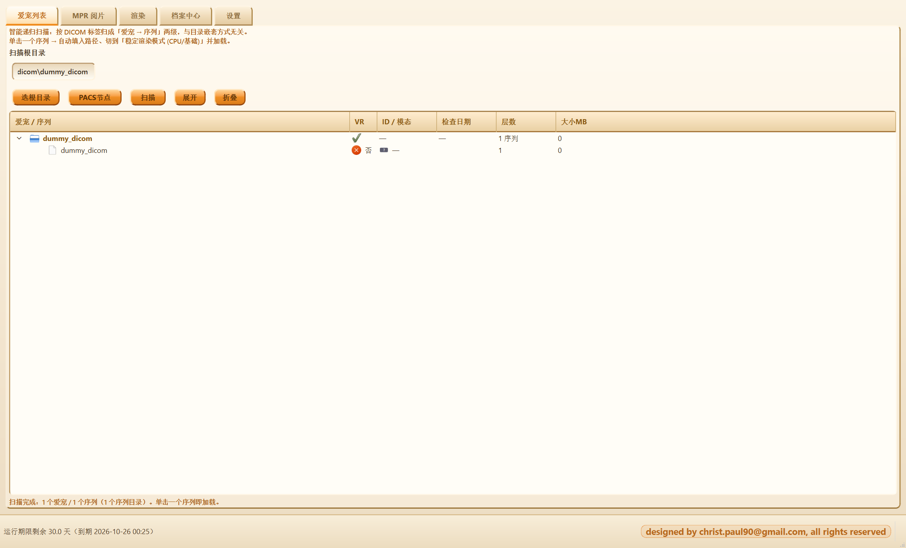
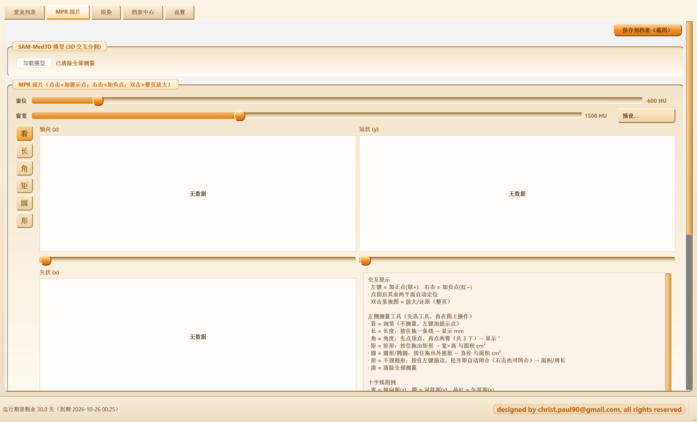
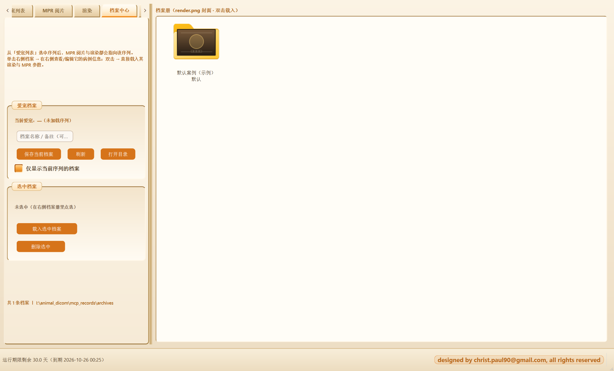
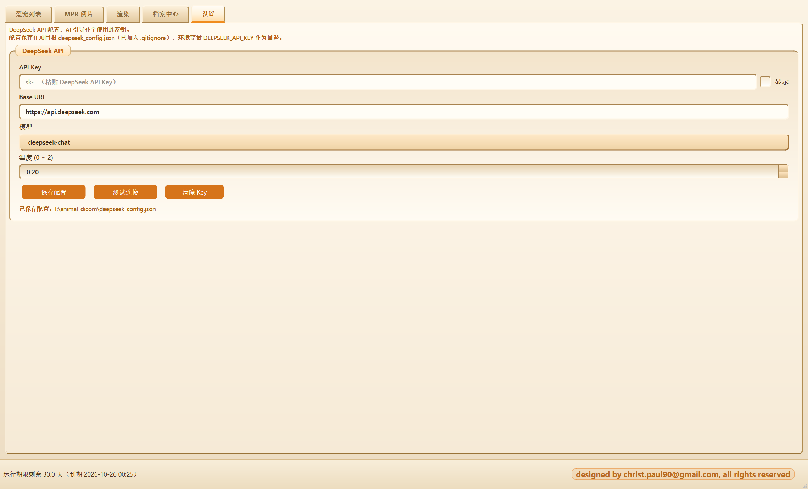

# Animal Dicom · 爱宠影像工作站

**面向宠物医院（犬 / 猫）的离线 CT · DR · MRI 影像工作站**
*MPR 阅片 · SSD+VR 融合体绘制 · PACS 取片 · 病例档案（含 AI 引导补全）· 可被 AI Agent 通过 MCP 接管*

[](../../releases/tag/v1.0.0)
[](https://www.python.org/)
[](https://doc.qt.io/qtforpython/)
[](https://vtk.org/)
[]()

> **English** — Animal Dicom is an offline veterinary (dog/cat) imaging workstation built on PySide6 + PyCt6 + VTK.
> It provides a five-tab workflow — **Patient list / MPR reader / 3D render / Case archive / Settings** — with
> an MPR reader (three orthogonal views, length/angle/rect/ellipse/polygon measurement, WW/WL presets, 3D-SAM
> interactive segmentation), 12 SSD+VR fusion rendering modes, PACS retrieval (C-ECHO / C-FIND / C-GET),
> a timestamped case archive with DeepSeek-assisted report completion, and a built-in TCP control bridge +
> MCP server (62 `ssdvr_*` tools) so any AI agent can drive the GUI. See [DEPENDENCIES.md](DEPENDENCIES.md)
> for the full dependency/resource inventory.

---

## 目录

- [这是什么](#这是什么)
- [核心特性](#核心特性)
- [界面预览](#界面预览)
- [快速开始（源码运行）](#快速开始源码运行)
- [五个页签与工作流](#五个页签与工作流)
- [依赖与资源清点](#依赖与资源清点)
- [Agent 集成：MCP 控制桥](#agent-集成mcp-控制桥)
- [运行期限（30 天强制）](#运行期限30-天强制)
- [构建与发布](#构建与发布)
- [目录结构](#目录结构)
- [功能自检脚本](#功能自检脚本)
- [常见问题](#常见问题)
- [许可与致谢](#许可与致谢)

---

## 这是什么

`Animal Dicom` 是给宠物医院用的**离线**影像工作站：把犬猫的 CT / DR / MRI 片子直接拖进来就能看、
能测、能出报告、能归档，并能把片子从 PACS 拉过来。它继承了原 `SSD+VR Fusion Viewer` 的体绘制内核，
但**按宠物的实际工作需要重新做了信息架构与交互**：

| 面向人医/科研的原版 | 本版本（爱宠工作站） |
|---|---|
| 页签：病人列表 / MPR / 渲染 / 自动ROI / K-edge / … | 页签：**爱宠列表 / MPR 阅片 / 渲染 / 档案中心 / 设置** |
| 自动 ROI（TotalSegmentator / SynthSeg / nnU-Net） | **已移除**，改为「MPR 阅片」页的 **3D SAM 交互式分割** |
| 深色科研风界面 | **暖橙浅色拟物皮肤**（`retro.qss`）+ 卡通猫吉祥物 |
| 术语「病人 / 患者」 | 全量改为「**爱宠**」 |
| 无档案概念 | **档案中心**：病例档案 + 时间戳版本 + 封面缩略图 |
| 无报告辅助 | **DeepSeek AI 引导补全**（按模板逐字段补全，可回溯每次 AI 修改） |
| 无 PACS | **PACS 取片**（C-ECHO / C-FIND / C-GET） |

## 核心特性

| 能力 | 说明 |
|---|---|
| **MPR 阅片** | 三视图（轴向/冠状/矢状）+ 滚轮翻层 + 双击单元格放大为 2×2 |
| **测量工具** | 长度 / 角度 / 矩形 / 圆形（椭圆）/ 不规则多边形（右击闭合），逐视图独立清空 |
| **窗宽窗位** | 独立滑块 + 预设（软组织 400/40、肺窗 1500/−600、骨窗 2000/400、脑窗 80/40、腹部 350/50） |
| **3D SAM 分割** | 在 MPR 上左键正点 / 右键负点 → 后台线程推理 → 绿色叠加，可保存为 ROI 记录（体积/HU 统计、一键导出 Excel） |
| **12 种渲染模式** | stable / hd_surface / cinematic / nature_channels / figure8_channels / layer_channel / frangi_channel / bone_mono / 2dtf / spectral / exposure_render / dual_volume |
| **SSD+VR 融合** | 骨骼表面 + 软组织体绘制，两套传输函数、独立不透明度滑块，over 混合 |
| **预处理** | 高斯 / NLM 去噪、CLAHE、Frangi 微通道（可选 CuPy GPU 加速）、2D 传输函数 |
| **PACS 取片** | 节点管理（`pacs_nodes.json`）、C-ECHO 连通性、C-FIND 查检查/序列、C-GET 拉取后一键载入阅片 |
| **档案中心** | 病例档案（5 段 24 字段模板）、`render.png` 封面、**时间戳版本**（`revisions/<时间>.json`）、默认示例病例（置顶、禁删） |
| **AI 引导补全** | DeepSeek 逐字段补全病历，写入 `meta.ai_log`；可自动存一版时间戳版本 |
| **爱宠列表** | 递归扫描病例目录、按序列分组、一键展开/收起、点击即加载 |
| **MCP 控制桥** | 进程内 TCP 桥 + 独立 MCP server，**62 个 `ssdvr_*` 工具**；默认**关闭**，`--mcp` 开启 |
| **运行期限** | 30 天强制期限（见[下文](#运行期限30-天强制)） |

## 界面预览

> 截图由本程序界面自身渲染（`tools/verify/bridge_selftest.py` 的整窗截图，离屏模式采集）；
> 因未加载数据，3D 渲染区为空白。

| 爱宠列表 | MPR 阅片 |
|---|---|
|  |  |

| 档案中心 | 设置 |
|---|---|
|  |  |

（`docs/images/ui-*.png`、`mode-*.jpg` 是原版 SSD+VR 的渲染模式示意，仍适用于渲染页的 12 种模式。）

## 快速开始（源码运行）

```bash
# 1) 环境：Python 3.11+（Windows 10/11 为第一目标平台）
python -m venv .venv && .venv\Scripts\activate

# 2) 依赖（基础版：阅片 + 渲染 + PACS + 档案，不含 3D SAM）
pip install -r requirements.txt

# 3) 运行
python ssd_vr_viewer.py                      # 干净启动
python ssd_vr_viewer.py --input "D:\病例\泰迪"   # 启动即加载目录/文件

# 可选：让 AI Agent 通过 MCP 接管（默认关闭）
python ssd_vr_viewer.py --mcp --mcp-port 7799
```

需要 3D SAM 交互式分割时再装完整版（含 CUDA 版 PyTorch）：

```bash
pip install torch==2.6.0 torchvision==0.21.0 --index-url https://download.pytorch.org/whl/cu124
pip install -r requirements-full.txt
python download_sam_med3d.py                 # 预下载 SAM-Med3D 权重（~383 MB）
```

## 五个页签与工作流

```
① 爱宠列表 ──► ② MPR 阅片 ──► ③ 渲染 ──► ④ 档案中心 ──► ⑤ 设置
   （扫描/加载）    （看片/测量/分割）  （SSD+VR 融合）   （病历+版本+AI）  （DeepSeek Key）
```

1. **① 爱宠列表** — 选病例根目录 → 「扫描」→ 树里按 爱宠 ▸ 序列 展开；点序列即加载。
   底部「PACS节点」进入取片子页（C-ECHO → C-FIND → C-GET → 载入阅片）。
   *此页与 MPR / 设置页一样隐藏右侧渲染区，让列表独占整窗。*
2. **② MPR 阅片** — 三视图阅片、测量、窗宽窗位；点选后「分割 ▶」出 3D SAM 结果；
   结果可存 ROI 记录（列表可加载回显/删除/一键导出 Excel）。
   *加载 DR/MR 等 2D 序列时会自动切到本页。*
3. **③ 渲染** — 12 种模式的 SSD+VR 融合；右侧渲染区 + 顶部「保存到档案（截图）」。
4. **④ 档案中心** — 档案册（文件夹图标带 `render.png` 封面）→ 病例详情（当前/历史版本/AI 引导补全）。
5. **⑤ 设置** — DeepSeek API Key / Base URL / 模型 / 温度，「保存」「测试连接」「清除 Key」。

## 依赖与资源清点

完整清点见 **[DEPENDENCIES.md](DEPENDENCIES.md)**（含"缺了会怎样"与不入库清单）。速览：

| 类别 | 内容 |
|---|---|
| **必需（基础版）** | PySide6、PyCt6、VTK、numpy、scipy、SimpleITK、pydicom、scikit-image、Pillow、matplotlib、openpyxl |
| **PACS** | pynetdicom（+ pydicom） |
| **3D SAM（可选）** | torch、medim、torchio（权重 ~383 MB 单独下载） |
| **Agent 集成（可选）** | fastmcp（仅 MCP server 侧；GUI 本身不需要） |
| **GPU 加速（可选）** | cupy-cuda12x、`ErCore.dll`（CR 路径追踪） |
| **遗留依赖** | TotalSegmentator / nnunetv2 / dipy —— 自动 ROI 功能已移除，仅无头 CLI 仍引用 |
| **运行期资源** | `retro.qss` / `light.qss` / `dark.qss`、`warm_orange.json`、`case_template.json`、`presets.xml`、`logo.*` |
| **不入库** | 数据集 `digital_body/`(99 GB)、冻结版产物、权重、`mcp_records/`（含病例档案与本机期限锚点） |

## Agent 集成：MCP 控制桥

GUI 进程内可启动一个**只绑 127.0.0.1** 的 TCP 桥，把界面的一切操作与状态暴露给 AI Agent：

```bash
python ssd_vr_viewer.py --mcp                 # 默认端口 7799（被占则自动向后探测）
# 或设环境变量：set SSD_VR_MCP=1
```

- **发现机制**：桥把真实端口写入 `%LOCALAPPDATA%\SSD_VR_MCP\bridge.json`，客户端也可扫描 7799–7898。
- **工具集**：`ssdvr_launch` / `ssdvr_state_snapshot` / `ssdvr_switch_tab` / `ssdvr_screenshot_window` /
  `ssdvr_mpr_set_window_level` / `ssdvr_sam_run` / `ssdvr_archive_*` / `ssdvr_pacs_*` / `ssdvr_settings_*` …共 **62 个**。
- **状态分块**：`query_state()` 返回 `tabs / mpr / roi_saved / archive / settings / pacs / case / ai / pets / trial`。
- **事件推送**：`load_start`、`progress`、`load_done`、`roi_done`、`roi_error`、`error`、`gui_ready`。
- **两个细节**：① 右侧渲染区在爱宠列表/MPR/设置页是隐藏的，截图前可用
  `ssdvr_screenshot(switch_to_render=true)` 自动切到渲染页；② 危险操作（删除档案/ROI 等）在 MCP 模式下
  不弹确认框，避免阻塞桥。

## 运行期限（30 天强制）

`license_guard.py` 实现**代码级**的 30 天期限，无 GUI 开关、无环境变量旁路：

- 到期时间 = **min(首次运行 + 30 天, `HARD_DEADLINE`)**；`HARD_DEADLINE` 是源码常量，**重装也无法超过它**。
- 首次运行时间写入 **4 个文件锚点 + HKCU 注册表**，每份带 HMAC；任一存活即恢复，签名不符即判篡改。
- 抗绕过：改日期（签名失败）/ 删锚点（有使用痕迹）/ 改系统时钟（回拨检测）/ 删 `license_guard.py`
  （完整性检查失败，退出码 4）——以上均**拒绝启动**（退出码 3/4）。
- 运行期 `QTimer` 每 5 分钟复核；状态栏常驻显示剩余天数。

> ⚠️ **能力边界（务必知情）**：本地校验无法做到数学意义的"不可解除"——改源码常量、反汇编补丁、
> 换干净机器都能绕过。本机制保证的是：**普通用户不能**通过改配置 / 删文件 / 改时钟绕过。
> 若要真正不可破解，需要服务端签发许可证 + 联网校验。

## 构建与发布

| 方式 | 命令 / 位置 |
|---|---|
| Windows EXE（PyInstaller） | `pyinstaller build.yaml`（`app.version` = 1.0.0；已含皮肤/模板/期限模块） |
| Windows 完整版（含 CUDA 依赖） | GitHub Actions `main-full.yml` |
| macOS `.app` / DMG | `pyinstaller --clean ssd_vr_viewer_macos.spec`，或 Actions `macos.yml` |

> 打包**必须**带上 `license_guard`（否则启动即报"完整性检查失败"）与
> `retro.qss / light.qss / warm_orange.json / case_template.json`（否则丢皮肤与病例模板）。
> 详见 [DEPENDENCIES.md §6](DEPENDENCIES.md)。

## 目录结构

```
ssd_vr_viewer.py        GUI 主程序（5 页签；~8700 行）
license_guard.py        30 天运行期限强制校验
pacs_client.py          PACS C-ECHO / C-FIND / C-GET
deepseek_client.py      DeepSeek chat/completions（纯 urllib）
ssd_vr_cli.py           无头批量渲染 CLI
segmentation/           SAM 分割管线 + 遗留检测器
mcp_ssd_vr/             控制桥 + MCP server（7 个工具模块 / 62 个工具）
tools/verify/           功能自检脚本（桥端到端 / 工具注册 / 期限对抗）
tools/screenshots/      界面截图采集
docs/images/            README 与文档配图
.github/workflows/      三个构建流水线
build.yaml              打包配置（datas + hidden-imports + 排除项）
```

## 功能自检脚本

```bash
python tools/verify/tools_static_check.py   # 工具层静态检查（不需要 GUI）：工具数/重名
python tools/verify/bridge_selftest.py      # 端到端：启带 --mcp 的 GUI，100 项桥/界面断言
python tools/verify/trial_guard_test.py     # 对抗性：到期/篡改/改时钟/删模块/假签名（含备份还原）
```

三个脚本均可在无显示环境下运行（`QT_QPA_PLATFORM=offscreen`），返回码 0 = 全部通过。

## 常见问题

| 现象 | 原因 / 处理 |
|---|---|
| 启动即提示「运行期限记录异常」 | 锚点被手改或系统时钟被回拨；见[运行期限](#运行期限30-天强制) |
| 冻结版提示「缺少运行期限校验模块」 | 打包漏了 `license_guard` hidden-import（见 DEPENDENCIES §6） |
| 截图是空白 | 当前页（爱宠列表/MPR/设置）隐藏了渲染区 → `ssdvr_screenshot(switch_to_render=true)` |
| 「一键导出 Excel」报 ImportError | 缺 `openpyxl`（v1.0.0 已补进 requirements） |
| 皮肤变成深色 | 缺 `retro.qss`/`light.qss`（打包未带），回退到 `dark.qss` |
| CR / Exposure Render 模式点不动 | 无 `ErCore.dll`（需 NVIDIA GPU + CUDA + ErCore）→ 自动回退 stable |
| 分割按钮无反应 | 未装完整版依赖（torch/medim/torchio）或权重未下载 |

## 许可与致谢

- 本项目为私有仓库（`hg3992260/Animal_Dicom`）；**未附带开源许可证**，未经授权请勿再分发。
- 体绘制与 CR 路径追踪参考并沿用原 `SSD+VR Fusion Viewer` 的实现；`ErCore.dll` 由
  `exposure-render-master`（第三方 CUDA 路径追踪引擎）构建，其许可与版权归原作者。
- 感谢 PySide6 / PyCt6 / VTK / SimpleITK / pynetdicom / SAM-Med3D 等开源项目。

---

<sub>版本 v1.0.0 · 2026-09-26 · 变更记录见 [CHANGELOG.md](CHANGELOG.md)</sub>
